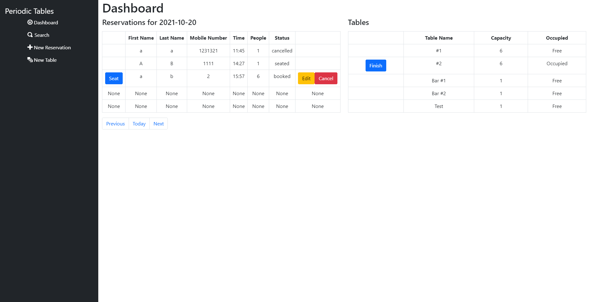
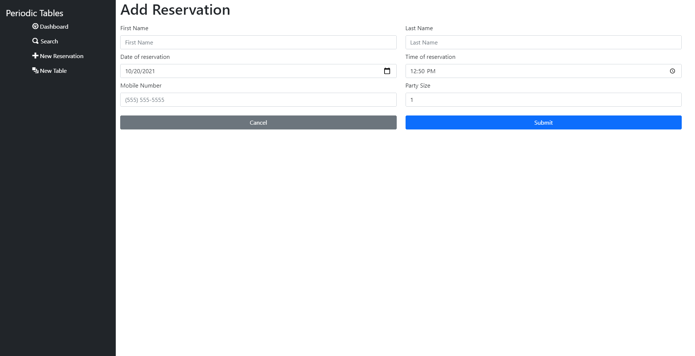
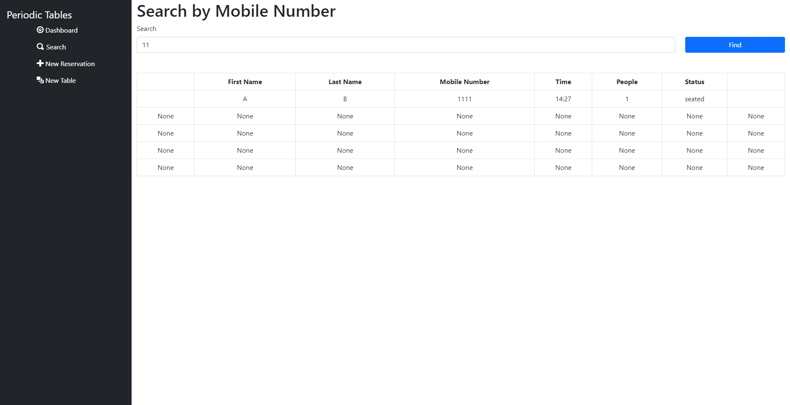
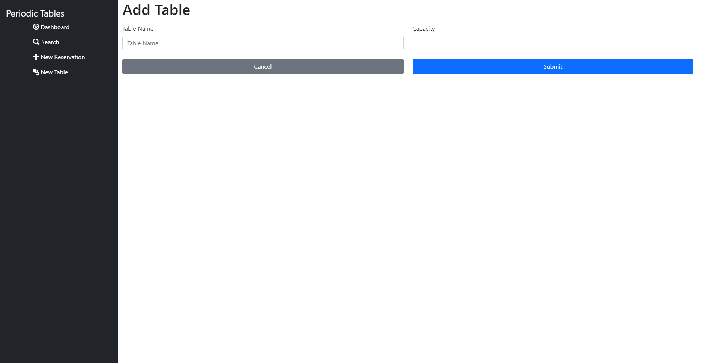

# Restaurant Reservation

> Fullstack restaurant reservation app built using Postgres, Express, Node, and React. This application is for managing reservations for a restaurant.

Deployment: https://rest-res-front.herokuapp.com

## Components

### Dashboard

The dashboard shows a table of both the reservations and the active tables. Reservation navigation can be done via the
nav button at the bottom of the page.

### Reservation Form

This form is used for creating and updating reservations

### Search

Search allow users to find reservations based on a passed in phone number

### New Table

The new table page allows users to create new tables to the program

## Backend

The backend is a REST API implemented using Express.js and Knex.js

All endpoints include proper validation This includes:

- All fields are required
- All fields are of the correct datatype
- When sending GET requests on list endpoints reservations with status finished aren't included
- Dates are formatted via Postgres
- Time validation doesn't include handling for different time zones
- All errors include appropriate HTTP codes
- Reservations on Tuesday are declined because the restaurant is closed
- Reservations are declined if they aren't during restaurant open hours
- Errors are all passed to the frontend and displayed in an error component which renders conditionally
- Updating a reservation runs validation ensuring that the requested changes can actually be made
- The search function does allow for searching of a partial phone number, as well

## Installation

1. Fork and clone this repository.
2. Run `cp ./back-end/.env.sample ./back-end/.env`.
3. Update the `./back-end/.env` file with the connection URL's to your ElephantSQL database instance.
4. Run `cp ./front-end/.env.sample ./front-end/.env`.
5. You should not need to make changes to the `./front-end/.env` file unless you want to connect to a backend at a
   location other than `http://localhost:5000`.
6. Run `npm install` to install project dependencies.
7. Run `npm run start:dev` to start your server in development mode.

## Technologies Used

- Front-End
    - React
    - HTML
    - CSS
    - Bootstrap
- Back-End
    - Express
    - Knex
    - Postgres
- Testing
    - Jest
    - Supertest
    - Puppeteer

